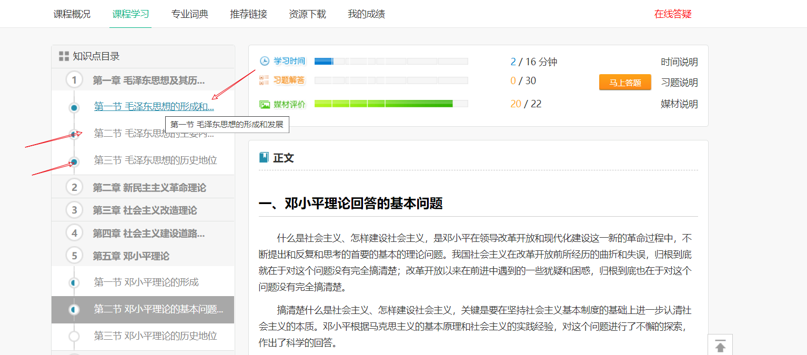
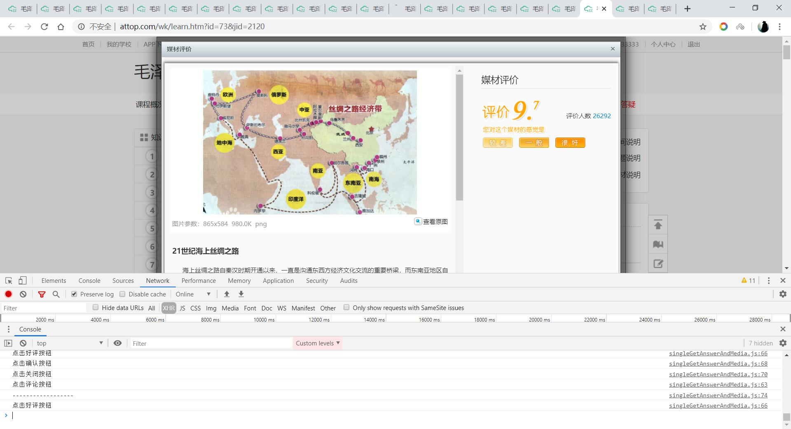
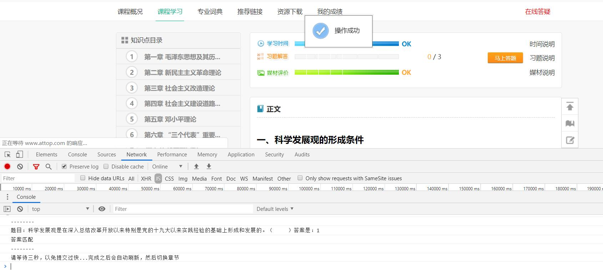
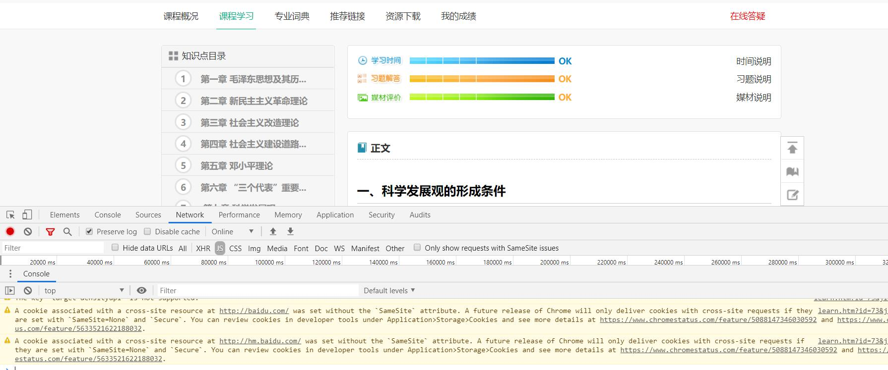

# 一个弱智的至善网刷题助手
> 只刷题，媒体评论可以使用之前的那个刷客来刷，时间可以按住Ctrl点击章节打开多个浏览器标签页并行地刷时间。
> 部分题目没有答案是因为导入题库的那个账号有没做完的，或者机会用完了的

> 目前有题库：毛概、中国近现代史纲要（无需重复上传）

> 管理员可以提供一个有思修、马克思，近代史、毛概课程的账号，需要马克思，思修题库的可以登录上传题库（联系管理员获取）


## 最佳实践（写在前面）
1. 进入课程页面
2. 按住键盘Ctrl键，点击每一节的标题打开多个标签页（可以并行地刷时间）


3. 在每一个标签页按F12呼出控制台，输入命令，等待即可
```
媒体与问题
var s = document.createElement('script');
s.src = "https://www.equator8848.xyz/courseHelper/singleGetAnswerAndMedia.js";
s.charset = 'utf-8';
document.getElementsByTagName('head')[0].appendChild(s);
```
```
只回答问题
var s = document.createElement('script');
s.src = "https://www.equator8848.xyz/courseHelper/singleGetAnswer.js";
s.charset = 'utf-8';
document.getElementsByTagName('head')[0].appendChild(s);
```
## 思路


### 弱智在哪里呢？
- 只能做题和刷媒体评论，哈哈哈
- 这里也有刷时间与媒体评论的软件（功能很完善，但是没有题库），不过基本用不上了 [至善网刷客，作者：超级马丁](至善网.zip)
- 需要手动换页，希望有大佬告诉我怎么换页（单纯的Js实现）


### 刷题
1. 正常登录自己的至善网账号
2. 进入第一章第一节的页面
3. 开启浏览器控制台
4. 输入对应代码即可自动作答（从服务器获取答案）
5. 进入第一章第二节的页面，重复以上步骤
6. [Js代码](/src/main/resources/static/singleGetAnswer.js) 
```
// 回答问题
var s = document.createElement('script');
s.src = "https://www.equator8848.xyz/courseHelper/singleGetAnswer.js";
s.charset = 'utf-8';
document.getElementsByTagName('head')[0].appendChild(s);
```
7. ~~小技巧 如果之前的都完成了的话（包括习题、评论、时间），可以使用如下代码快速找到哪些页面没有刷（当然之前需要至少使用上面的刷题脚本刷了一次）~~（鸡肋）
```
$pages = $('.nHalf');
var url = $($pages[0]).children('a:first').attr('href');
window.location.href = url;
```


### 导入题库（导入一次即可）
1. 找到一个基本做完了的的至善网账号
2. 进入第一章第一节的页面
3. 开启浏览器控制台
4. 输入对应代码即可上传答案（将问题与答案上传到服务器保存）
5. 进入第一章第二节的页面，重复以上步骤
6. [Js代码](/src/main/resources/static/singleUoloadAnswer.js) 
7. 上传通道需要密钥，请联系管理员获取！


## 截图说明
- 输入指令

- 等待

- 完成，切换到下一个章节

